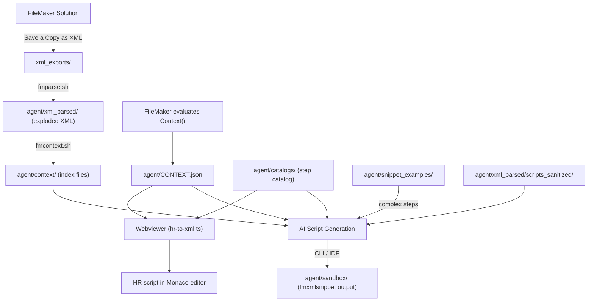

# Architecture

This document describes the architecture of the agentic-fm project -- the data pipeline, the role of each artifact, and the conventions that govern how AI agents interact with FileMaker solution data. It is intended to be read by both humans and AI so that new features can be added with full awareness of how the pieces fit together.

## Pipeline Overview



Data flows through three stages before it reaches an AI agent:

1. **Export** -- A FileMaker solution is exported as XML via _Save a Copy as XML_.
2. **Parse** -- `fmparse.sh` archives the export and explodes it into hundreds of individual XML files organised by domain (tables, scripts, layouts, etc.) inside `agent/xml_parsed/`.
3. **Index** -- `fmcontext.sh` distills the exploded XML into a small set of pipe-delimited index files in `agent/context/`, extracting only signal (names, IDs, types, references) and discarding noise (UUIDs, hashes, timestamps, visual positioning).

At script-generation time three additional inputs converge:

- **CONTEXT.json** -- generated inside FileMaker by the `Context()` custom function. It is scoped to the current layout and task, providing exactly the tables, fields, relationships, layouts, scripts, and value lists the AI needs, complete with IDs that can be embedded directly into fmxmlsnippet output.
- **Step catalog** (`agent/catalogs/step-catalog-en.json`) -- structured JSON reference for all FileMaker script steps. Provides step IDs, parameter definitions, types, enums, and HR signatures. This is the primary source for step XML structure.
- **snippet_examples/** -- boilerplate fmxmlsnippet templates for complex steps or those whose catalog entry is incomplete. Acts as a fallback when the step catalog alone is insufficient.

The AI combines these inputs to produce fmxmlsnippet output in `agent/sandbox/`, which is then pasted back into FileMaker via the clipboard. The **webviewer** provides a parallel workflow where the same CONTEXT.json and step catalog feed a browser-based editor; HR-to-XML conversion happens client-side via `webviewer/src/converter/hr-to-xml.ts`.

## Artifact Inventory

| Artifact             | Location                              | Generated By                   | Purpose                                                       |
| -------------------- | ------------------------------------- | ------------------------------ | ------------------------------------------------------------- |
| Raw XML export       | `xml_exports/<Solution>/<date>/`      | FileMaker (manual)             | Archived source of truth                                      |
| Exploded XML         | `agent/xml_parsed/`                   | `fmparse.sh`                   | Per-object XML fragments for deep inspection                  |
| Sanitized scripts    | `agent/xml_parsed/scripts_sanitized/` | `fmparse.sh`                   | Human-readable script text (~90% smaller than XML)            |
| Index files          | `agent/context/*.index`               | `fmcontext.sh`                 | Compact, greppable lookup tables covering the entire solution |
| CONTEXT.json         | `agent/CONTEXT.json`                  | FileMaker `Context()` function | Scoped context for a single script-generation request         |
| CONTEXT.example.json | `agent/CONTEXT.example.json`          | Manual (checked in)            | Schema reference and realistic example                        |
| Snippet examples     | `agent/snippet_examples/`             | Manual (checked in)            | Canonical fmxmlsnippet templates for each step type           |
| Step catalog         | `agent/catalogs/step-catalog-en.json` | Manual (checked in)            | Structured reference for all script steps -- IDs, params, types, enums, HR signatures |
| Webviewer            | `webviewer/`                          | Manual (checked in)            | Browser-based visual script editor with live HR-to-XML conversion and AI chat |
| Generated scripts    | `agent/sandbox/`                      | AI agent                       | fmxmlsnippet output ready for clipboard import                |
| Validation script    | `agent/scripts/validate_snippet.py`   | Manual (checked in)            | Post-generation validation of fmxmlsnippet output             |

## Context Hierarchy

The AI uses a strict hierarchy when looking up FileMaker objects. This hierarchy exists to minimise token consumption -- each level is progressively larger and more expensive to read.

```
Priority 1 ─ agent/CONTEXT.json         (scoped to the current task, ~2-5 KB)
Priority 2 ─ agent/context/*.index       (solution-wide indexes, ~50-100 KB total)
Priority 3 ─ agent/xml_parsed/           (full exploded XML, several MB)
```

1. **CONTEXT.json** -- Read first. Contains everything needed for the current task with IDs ready to use.
2. **Index files** -- Search via `grep` when CONTEXT.json is missing an object. Each index file is a single flat file covering the entire solution.
3. **xml_parsed/** -- Last resort. Only grep into this directory when indexes and CONTEXT.json both lack the needed information.

## Index File Format

All index files in `agent/context/` follow the same conventions:

- **Pipe-delimited**, one record per line.
- **Header comment** on the first line documents the column order.
- **No quoting or escaping** -- the data does not require it.
- Generated by `fmcontext.sh` using `xmllint --xpath` against the exploded XML.

| File                      | Columns                                                                                              | Source in xml_parsed         |
| ------------------------- | ---------------------------------------------------------------------------------------------------- | ---------------------------- |
| `fields.index`            | `TableName\|TableID\|FieldName\|FieldID\|DataType\|FieldType\|AutoEnterCalc\|Flags`                  | `tables/**/*.xml`            |
| `relationships.index`     | `LeftTO\|LeftTOID\|RightTO\|RightTOID\|JoinType\|LeftField=RightField\|CascadeCreate\|CascadeDelete` | `relationships/**/*.xml`     |
| `layouts.index`           | `LayoutName\|LayoutID\|BaseTOName\|BaseTOID\|FolderPath`                                             | `layouts/**/*.xml`           |
| `scripts.index`           | `ScriptName\|ScriptID\|FolderPath`                                                                   | `script_stubs/**/*.xml`      |
| `table_occurrences.index` | `TOName\|TOID\|BaseTableName\|BaseTableID`                                                           | `table_occurrences/**/*.xml` |
| `value_lists.index`       | `ValueListName\|ValueListID\|SourceType\|Values`                                                     | `value_lists/**/*.xml`       |

## CONTEXT.json Schema

`CONTEXT.json` is the single most important file the AI reads. It is generated by FileMaker's `Context()` custom function and is scoped to the layout where the user invokes it.

Top-level keys:

| Key                | Type   | Description                                                                         |
| ------------------ | ------ | ----------------------------------------------------------------------------------- |
| `solution`         | String | FileMaker file name                                                                 |
| `task`             | String | Natural-language description of what to create                                      |
| `current_layout`   | Object | `name`, `id`, `base_to`, `base_to_id`                                               |
| `tables`           | Object | Keyed by base table name; each entry has `id`, `to`, `to_id`, and a `fields` object |
| `ddl`              | String | SQL DDL with FOREIGN KEY constraints and field comments                             |
| `relationships`    | Array  | Join definitions: TOs, join type, join fields, cascade settings                     |
| `scripts`          | Object | Scripts the AI may call: `{ "name": { "id": N } }`                                  |
| `layouts`          | Object | Layouts the AI may navigate to: `{ "name": { "id": N, "base_to": "..." } }`         |
| `value_lists`      | Object | Value lists: `{ "name": { "id": N, "values": [...] } }`                             |
| `layout_objects`   | Array  | Named objects on the current layout (for `Go to Object[]`)                          |
| `custom_functions` | Object | _(optional)_ Custom functions available in the solution                             |

See `agent/CONTEXT.example.json` for a complete, realistic example.

## Step Catalog

`agent/catalogs/step-catalog-en.json` is the canonical structured reference for all FileMaker script steps. It sits between CONTEXT.json (which provides solution-specific IDs) and snippet_examples (which provide complex XML templates). For the majority of steps, the catalog alone is sufficient to construct correct fmxmlsnippet XML.

Each catalog entry provides:

| Field            | Purpose                                                                           |
| ---------------- | --------------------------------------------------------------------------------- |
| `id`             | FileMaker internal step ID -- use in `<Step id="X">`                              |
| `selfClosing`    | `true` = `<Step ... />`, `false` = `<Step ...>...</Step>`                         |
| `params[]`       | Full parameter spec: `xmlElement`, `type`, `hrLabel`, `wrapperElement`, `xmlAttr`, `required`, `defaultValue`, `enumValues` |
| `hrSignature`    | Human-readable parameter format for HR output                                     |
| `monacoSnippet`  | VS Code / Monaco snippet for autocomplete                                         |
| `blockPair`      | Matching step partners and role (`open`/`middle`/`close`)                         |
| `snippetFile`    | Path to the corresponding snippet_examples file (fallback reference)              |
| `status`         | `"complete"` = fully reviewed, `"auto"` = unreviewed, `"unfinished"` = partial    |

Consumers: CLI/IDE agents (grep for step structure), webviewer (HR-to-XML converter and Monaco autocomplete), and `validate_snippet.py` (step name validation).

## Interaction Modes

The toolchain supports three interaction modes. All share the same `agent/` folder, CONTEXT.json, and step catalog.

| Aspect           | CLI (e.g. Claude Code)              | IDE (e.g. Cursor, VS Code)          | Webviewer                                      |
| ---------------- | ----------------------------------- | ----------------------------------- | ---------------------------------------------- |
| Interface        | Terminal                            | Editor with AI pane                 | Browser (standalone or embedded in FileMaker)   |
| Output format    | fmxmlsnippet XML in `agent/sandbox/`| fmxmlsnippet XML in `agent/sandbox/`| HR script in Monaco editor                      |
| XML generation   | Agent constructs XML from catalog   | Agent constructs XML from catalog   | Client-side `hr-to-xml.ts` converter            |
| AI provider      | Model behind the CLI/IDE            | Model behind the CLI/IDE            | Anthropic API, OpenAI API, or Claude Code CLI   |

The webviewer is a Preact + Monaco + Vite application in `webviewer/`. Its three-panel layout provides a Monaco script editor, live XML preview, and integrated AI chat. It can run as a standalone browser app or embedded inside a FileMaker WebViewer object. See `webviewer/WEBVIEWER_INTEGRATION.md` for full details.

## Script Generation Workflow

The AI follows a mandatory sequence when generating fmxmlsnippet output:

1. **Read `agent/CONTEXT.json`** -- understand the task and collect all reference IDs.
2. **Grep the step catalog** (`agent/catalogs/step-catalog-en.json`) for each step type being generated. For steps with `"status": "complete"`, construct XML directly from the catalog's `params` array. Fall back to reading the corresponding `agent/snippet_examples/` file for complex or incomplete steps.
3. **Substitute IDs and names** from CONTEXT.json into the step structure.
4. If a reference is missing from CONTEXT.json, search the relevant `agent/context/*.index` file.
5. Only fall back to `agent/xml_parsed/` as a last resort.
6. Write the resulting fmxmlsnippet to `agent/sandbox/`.
7. Run `validate_snippet.py` to check the output for structural and reference errors before handing it to the user.

Output rules:

- All output is fmxmlsnippet XML wrapped in `<fmxmlsnippet type="FMObjectList">`.
- Output contains **script steps only** -- never wrap in `<Script>` tags.
- Step structures must match the step catalog or snippet_examples; never invent or guess XML structure.
- Paired steps (e.g. `If` / `End If`, `Open Transaction` / `Commit Transaction`) must always appear together.
- In the webviewer context, output HR format instead of XML -- the client-side converter handles the translation.

## CLI Tools

### fmparse.sh

Archives a FileMaker XML export and explodes it into per-object XML files using [fm-xml-export-exploder](https://github.com/bc-m/fm-xml-export-exploder).

```
./fmparse.sh -s "<Solution Name>" <path-to-export> [options]
```

- Clears and repopulates only the current solution's subdirectories within `agent/xml_parsed/` on each run, preserving other solutions' data. This supports the FileMaker data separation model where multiple files (e.g. UI.fmp12, Data.fmp12) are parsed independently.
- Archives the export under `xml_exports/<Solution>/<date>/`.

### fmcontext.sh

Generates AI-optimised index files from the exploded XML.

```
./fmcontext.sh
```

- Reads `agent/xml_parsed/` and writes to `agent/context/`.
- Uses `xmllint --xpath` (ships with macOS; `libxml2-utils` on Linux).
- Clears and regenerates the output directory on each run.
- Run after `fmparse.sh` whenever the solution XML changes.

### validate_snippet.py

Validates fmxmlsnippet output in `agent/sandbox/` for common errors before pasting into FileMaker.

```
python agent/scripts/validate_snippet.py [file_or_directory] [options]
```

- Defaults to validating all files in `agent/sandbox/`.
- Auto-detects `agent/CONTEXT.json` for reference cross-checking.
- Checks: well-formed XML, correct root element, no `<Script>` wrapper, required step attributes, paired step balancing (If/End If, Loop/End Loop, Open Transaction/Commit Transaction), Else/Else If ordering, known step names (against snippet_examples), and field/layout/script ID cross-references against CONTEXT.json.
- Use `--context <path>` to specify an alternate CONTEXT.json, `--snippets <path>` for a custom snippet_examples directory, or `--quiet` for errors-only output.
- Exit code 0 = all files passed, 1 = one or more files failed.

### Context() custom function

A FileMaker custom function (`filemaker/Context.fmfn`) that generates `CONTEXT.json` at runtime inside the FileMaker solution.

```
Context ( "Create a script to add a new line item to the current invoice" )
```

- Requires FileMaker Pro 21.0+.
- Evaluates on the current layout and auto-discovers relevant TOs, fields, and relationships.
- Invoked automatically by the **Push Context** companion script (`filemaker/agentic-fm.xml`).
- See `docs/Context.fmfn.md` for the full technical reference.

## Adding New Features

When extending this project, keep the following principles in mind:

1. **Preserve the context hierarchy.** Any new data source should slot into the existing priority order (CONTEXT.json > index files > xml_parsed). If you add a new index file, document it in this file and in `.cursor/AGENTS.md`.

2. **Keep indexes lean.** Index files exist to reduce token consumption. Only extract signal -- names, IDs, types, and references. Discard UUIDs, hashes, timestamps, and visual positioning data.

3. **Follow existing conventions.** New index files should be pipe-delimited with a header comment. New CLI tools should follow the `set -euo pipefail` / `msg()` / `error()` pattern used by `fmparse.sh` and `fmcontext.sh`.

4. **Update documentation together.** When adding a new artifact or changing the pipeline:
   - Update this file (`ARCHITECTURE.md`) with the new artifact and its role.
   - Update `.cursor/AGENTS.md` so the AI knows how to use the new artifact.
   - Update `README.md` if the change affects end-user workflow or project structure.

5. **The step catalog is the primary step structure reference.** `agent/catalogs/step-catalog-en.json` is the first place to look for step XML structure. `snippet_examples/` serves as the fallback for complex steps or those with `"auto"`/`"unfinished"` status. If you add support for a new script step type, add its catalog entry and a corresponding snippet_examples template. All snippet files must follow the conventions in `agent/snippet_examples/steps/CONVENTIONS.md`.

6. **CONTEXT.json is generated, not authored.** Changes to the CONTEXT.json schema require updating the `Context()` custom function in FileMaker (`filemaker/Context.fmfn`), not just the example file. The `agent/CONTEXT.example.json` file and `docs/Context.fmfn.md` should be updated to reflect any schema changes.

7. **xml_parsed is read-only.** Never modify files in `agent/xml_parsed/`. It is a reference copy of the exploded FileMaker XML. Each solution's subdirectories are regenerated when `fmparse.sh` runs for that solution.

8. **Webviewer changes require converter parity.** If you modify the step catalog or add new step types, verify that the webviewer's HR-to-XML converter (`webviewer/src/converter/hr-to-xml.ts`) handles the changes correctly. The converter must stay in sync with the catalog.

## Dependencies

| Dependency                                                               | Required By          | Notes                                      |
| ------------------------------------------------------------------------ | -------------------- | ------------------------------------------ |
| [fm-xml-export-exploder](https://github.com/bc-m/fm-xml-export-exploder) | `fmparse.sh`         | Must be on PATH                            |
| `xmllint`                                                                | `fmcontext.sh`       | Ships with macOS; `libxml2-utils` on Linux |
| FileMaker Pro 21.0+                                                      | `Context()` function | For `GetTableDDL` and `While` support      |
| Node.js 18+                                                              | `webviewer/`         | For Vite dev server and build              |
